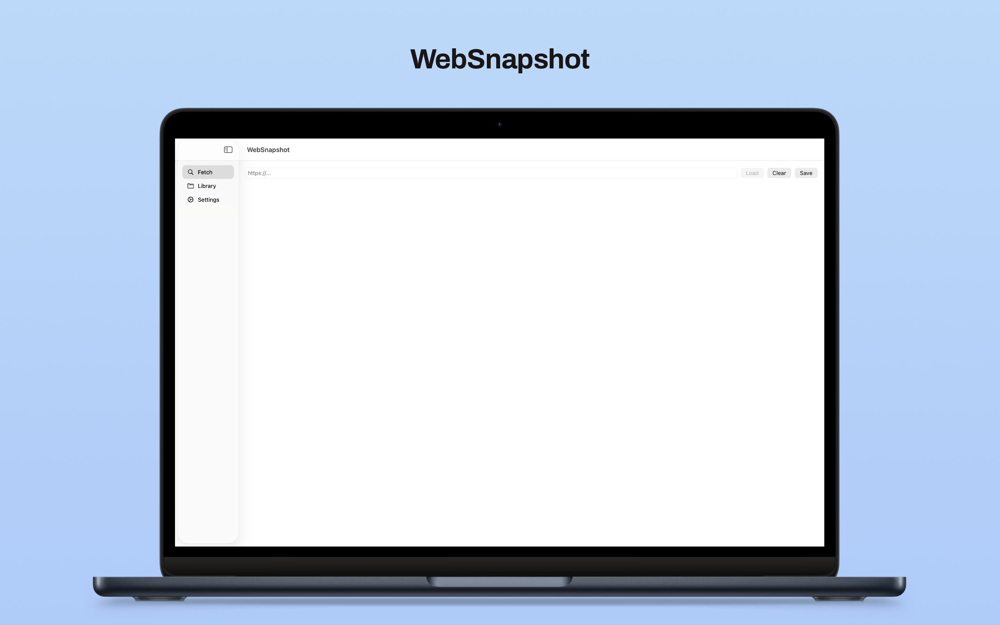

# WebSnapshot

<!---->

WebSnapshot is a tool that converts any web page into a PDF and saves it locally.

It is useful for preserving professional or technical articles. Unlike browser bookmarks or reading lists, once a page is saved it can be viewed without a network connection. The saved page is stored as a PDF, allowing you to access the content offline at any time.

While reference management tools are designed specifically for organizing academic papers, WebSnapshot is designed for saving general web content rather than managing scholarly publications.

This makes it particularly useful for preserving technical or scientific articles found on websites.

Because pages are saved as standard PDF files, they can easily be found using the OS built-in search features. You can also save them anywhere you like, using any directory structure you prefer.

There is also a feature that allows you to translate saved PDF files.

## Key Features
- **Fetch** 
Fetch and save websites.

- **Library** 
Manage saved PDF files.
  - List: View a list of saved PDF files.
  - Search: Search saved PDF files by title, tag, or a combination of title and tags.
  - View: View saved PDF files and translate their displayed content.
  - Delete: Delete saved PDF files.
  - Tags: Add, remove, and edit tags associated with saved PDF files.
 
- **Settings** 
  - Appearance: Choose from three appearance options: Light, Dark, or System.
  - Storage Location: Configure where PDF files are saved:
    - Fixed: Always save PDF files to a designated directory. Click [Change…] to specify the directory.
    - Flexibility: Choose the destination directory each time you save a PDF file.
